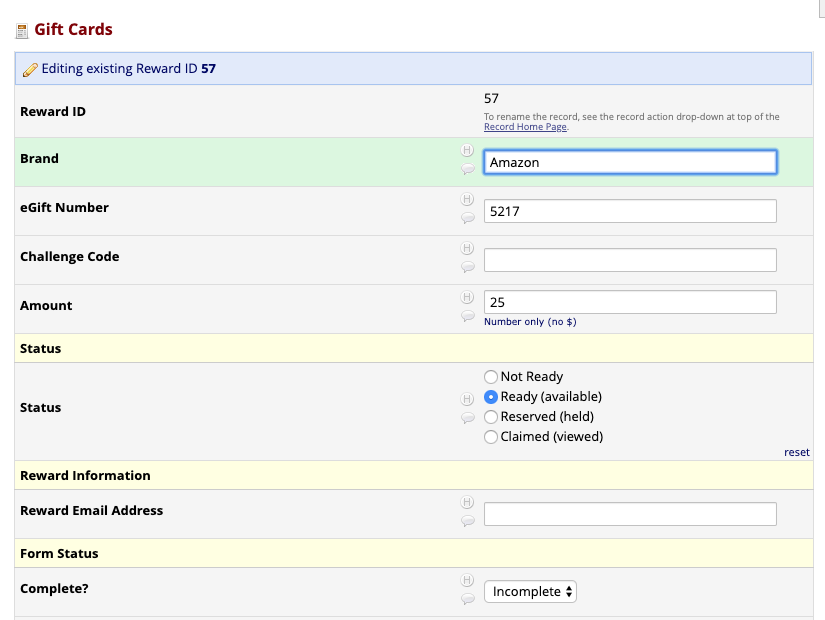
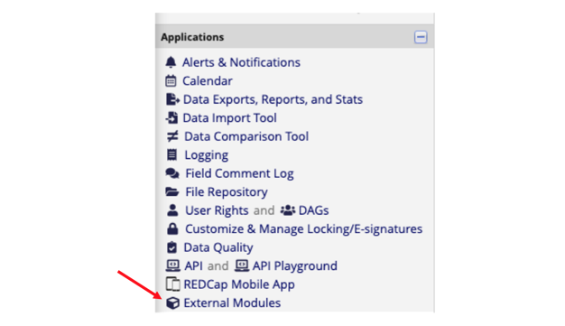
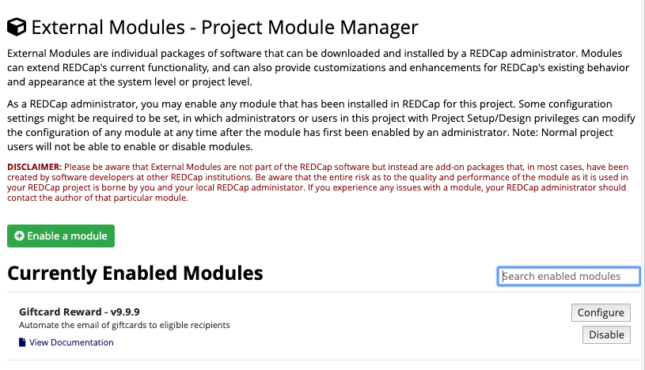
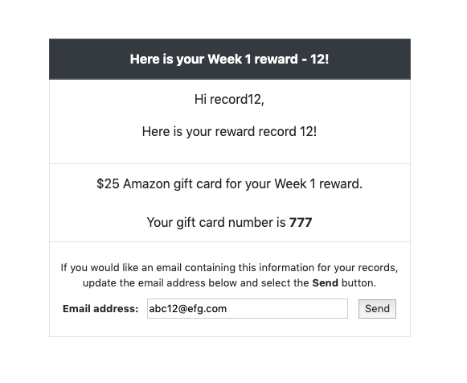

# Gift Card Rewards

This module will automate the dispersement of gift cards for use in projects offering rewards.

This module requires two REDCap projects: 1) the project where study data is stored and (study project), and 2) a gift card library 
repository project where gift cards are loaded for dispersement (library project).  These two projects work in tandem to disperse
gift cards at the proper time as specified by logic in the configuration file.  The gift card library project can be used for more
than one gift card study project.

The module must be enabled for the study project (not the gift card library). 

# Overview
This module is designed to evaluate project specific logic when a record is saved and when the logic becomes true, a reward is
processed for the participant. The reward processing consists of looking for an available gift card in the library project and setting
the status of the reward to Reserved and saving a Reserved timestamp.  A few other items of information are also saved in the library
project, such as, the name of the reward, and the record in the study project that is being sent the reward. An unique token is generated
for each reward which is used in the URL used to display the reward. 

The study project will save the Reserved status and and the record of the library project which contains the reward being sent to this
participant. Then, an email is sent to the participant with a link to a webpage that will display their reward. The email sent can
be customized with information stored in the project through the use of piping.

Once the participant clicks on the email link, a webpage will be launched that contains their reward code.  From this webpage, participants
will be able to send that reward code to themselves so they can store a copy of the code. The email address that is sent a copy of the
reward code will be stored in the library project.

This module is able to send multiple rewards per project.  For instance, if your study specifies granting a reward after filling out a Baseline
Questionnaire, after Week 3 and at the end of the study, each of these reward timeframes can be setup in the gift card configuration. There
are no limits to the number of rewards one study project can gift.  Each reward configuration must use the same library project.

A new feature to this module is the ability to evaluate the reward logic from a cron job once a day at 9am.  When this option is selected in 
the configuration setup, a cron job will run at 9am each day to evaluate gift card logic and determine if participants qualify for a reward.
The use case for using a cron job is when logic is date dependent.

Unless a project opts out, there is a daily summary that send to the Alert Email address which summarizes the status of the gift card
dispersement for the previous day.  If more than one configuration is setup for study project, one email will be sent summarizing all
setups.

# Setup
The gift card library project must have the following fields:

There is an xml and csv template which can be used in Github. The gift card information which is be to dispersed to participants can be imported into the project from a csv file.

The gift card project first enables the External Module.

Once the module is enabled, open the configuration file.

To setup a gift card configuration for a project, there are 3 main sections, described below.

Reward Library

The Reward Library section requires you to enter information on the location of the library project. This project can be used for more than one
gift card project configuration but the same library project must be used for each reward of the study project.

Reward Configuration

There may be many instances of this section if there are multiple rewards dispersed by this project.
Each instance requires information about the specific reward. Among the required information are the reward logic, reward title and the
field which holds the email address of the participant.

Notification Settings

The Notification Settings section determines when notifications will be sent to the study project Alert Email.  For instance, you can specify at 
which point you would like to be notified when the gift card inventory drops below a threshold.

# Reward Processing

Each time a record is saved in the Gift Card Project, a check will be performed to see if the participant is eligible for a reward. 
Once a participant is found eligible, the following steps will be performed:

    1) An unused reward record meeting the monetary requirement in the Gift Card Library will be reserved for this participant
    2) The participant will receive an email with a link included to their reward gift card
    3) Once the participant clicks on the link, the reward will be display on the webpage
    4) The Gift Card Library project record will have a update the status of the record to Claimed with a timestamp
    5) The Gift Card Project record will update the reward status to Claimed
    
Once the participant clicks on the link received in the rewards email, the reward display appears as follows:

Participants have the option to send themselves or someone else a copy of the reward number for future reference.

#Cron Processing

There are 2 cron jobs running daily:

Gift Card Summary

The Summary cron job will send a nightly updates to the Alert Email address specified in the configuration file.  The nightly summary 
displays the following data:

Logic Checker

The Logic Checker cron job will run at 9am each morning and look for the configurations who have the "Enable 9am cron job to check logic" checkbox enabled.
Configurations should enable this cron logic checker only when they have a date component to their reward logic.  This cron will ensure the
reward is sent on the appropriate date even if the record is not saved on the day it is eligible.

# Future Enhancements
    - Add the ability for projects to download a standard Gift Card Library Template
    - Add the ability to rate limit the number of cards that can be awarded per day